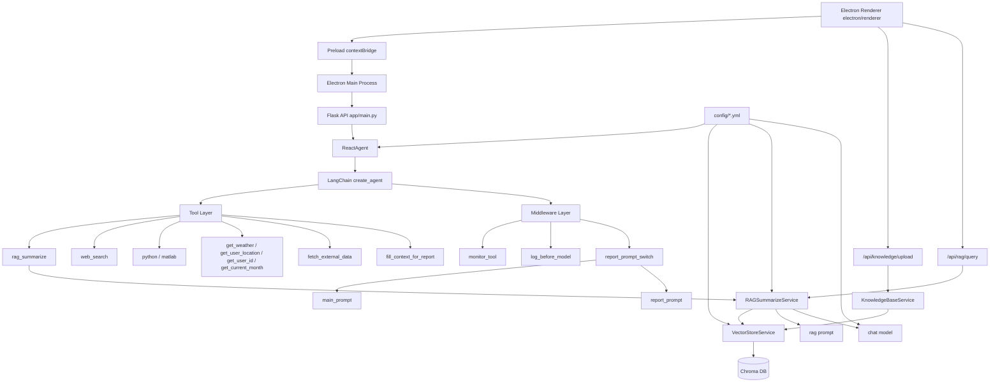

# AI Agent 框架 开发规范（团队内开发版）

> 版本：2026-03（基于当前仓库代码快照）

## 1. 文档目标

本开发规范面向团队内部开发，聚焦三件事：

1. 当前架构长什么样（模块边界与运行链路）
2. 目前开发不足在哪里（已识别技术债）
3. 下一步可扩展什么（可落地的演进方向）

---

## 2. 当前架构

### 2.1 总体架构图


### 2.2 模块职责（按目录）

- app/main.py
	- Flask API 服务入口（后端服务层）
	- 提供 /、/api/chat、/api/health、/api/knowledge/upload、/api/rag/query
	- 提供知识库生命周期管理接口：/api/knowledge/sync、/api/knowledge/snapshot、/api/knowledge/rollback
	- ReactAgent 惰性初始化，降低启动耗时
- electron/main.js
	- Electron 主进程：窗口管理、后端健康检查、后端自动拉起
	- IPC 路由：聊天流式转发、RAG 查询、知识库上传与生命周期操作
- electron/preload.js
	- 通过 contextBridge 暴露受限 API 到渲染层
	- 避免在渲染层直接暴露 ipcRenderer，降低攻击面
- electron/renderer/*
	- Electron 桌面端 UI
	- 承载聊天、在线 RAG、知识库上传、sync/snapshot/rollback 操作
- agent/tools/react_agent.py
  - 封装 create_agent
  - 注入工具列表、系统提示词、中间件
- agent/tools/agent_tools.py
	- 定义工具函数（RAG、联网搜索、Python/MATLAB 执行、外部数据、用户上下文、天气等）
- agent/tools/middleware.py
  - 工具调用监控
  - 模型调用前日志
  - 按 context.report 动态切换提示词
- rag/vector_store.py
  - 文档加载与切分
  - Chroma 向量入库与 retriever 构建
  - 生命周期治理：source->md5 索引清单、失效源文件清理、快照与回滚
- rag/knowledge_base.py
	- 文本知识上传服务（upload_by_str）
	- 生命周期服务透传（sync_removed_sources / create_snapshot / rollback_snapshot）
	- 复用 VectorStoreService，统一向量库与去重逻辑
- rag/config_data.py
	- 兼容层配置映射
	- 将新增模块参数映射到现有 config/*.yml
- rag/rag_service.py
  - RAG 召回与摘要生成链
  - PromptTemplate + ChatModel + OutputParser
- model/factory.py
  - 聊天模型与 embedding 模型工厂
- utils/*
  - 配置读取、路径处理、日志、文件加载、提示词加载

### 2.3 请求执行链路

1. 用户在 UI 输入问题
2. Electron 渲染层通过 preload 暴露的 API 调用主进程 IPC
3. Electron 主进程向 Flask API 发起 HTTP 请求
4. 可选两种在线模式：
	- Agent 模式：ReactAgent 发起 agent.stream(..., stream_mode="values")
	- 在线RAG模式：/api/rag/query 直接走向量检索问答链
5. 在线RAG模式执行流程：问题向量化检索 -> 拼接命中段落为提示词上下文 -> LLM 生成回答 -> 返回命中片段
6. Agent 模式下，monitor_tool 记录调用信息，并在 fill_context_for_report 后写入 context.report=True
7. report_prompt_switch 每次模型调用前选择 main_prompt 或 report_prompt
8. 输出结果经 Electron 主进程回传到桌面界面

### 2.4 数据与配置流

- 模型配置：config/rag.yml
- 向量库配置：config/chroma.yml
- 提示词路径配置：config/prompts.yml
- 外部业务数据配置：config/agent.yml
- 知识数据目录：data/
- 向量持久化目录：chroma_db/
- 文件去重指纹：md5.text
- 生命周期清单：chroma_manifest.json
- 生命周期快照目录：chroma_snapshots/

---

## 3. 本地开发与调试流程

### 3.1 建议启动顺序

建议优先安装完整依赖：

```bash
pip install -r requirements.txt
```

```bash
python rag/vector_store.py
cd electron
npm install
npm start
```

说明：Electron 桌面端会优先探测本地 Flask API；若未运行，会自动尝试拉起 `python -m app.main`。

### 3.2 开发常用检查点

- 检查配置是否可读：config/*.yml 路径和键名
- 检查提示词是否有效：prompts/*.txt 当前应为可执行业务提示，而非占位文本
- 检查向量库是否已有数据：chroma_db/ 与 md5.text
- 检查日志输出：logs/

### 3.3 知识库上传（Electron）

- Electron 页面包含上传区，支持选择 txt 文本并写入同一 Chroma 集合
- 接口为 POST /api/knowledge/upload（multipart/form-data，字段名 file）
- 上传逻辑会做内容去重，重复内容会返回跳过提示

### 3.4 在线RAG问答（Electron）

- Electron 聊天区包含开关“在线RAG直答（问题向量检索知识库后回答）”
- 开启后，问题会直接发送到 POST /api/rag/query
- 接口返回 answer 和 references（命中段落），前端会展示答案与前3条命中片段摘要

### 3.5 向量生命周期管理（Electron + API）

- 命令行方式：
	- 全量增量同步：`python rag/vector_store.py load`
	- 删除失效源文件向量：`python rag/vector_store.py sync`
	- 创建快照：`python rag/vector_store.py snapshot --tag release_note`
	- 回滚快照：`python rag/vector_store.py rollback 快照目录名`
- 接口方式（便于管理端调用）：
	- `POST /api/knowledge/sync`
	- `POST /api/knowledge/snapshot`（JSON: `{ "tag": "xxx" }`）
	- `POST /api/knowledge/rollback`（JSON: `{ "snapshot": "xxx" }`）

Electron 页面已提供以上三类操作入口（同步、创建快照、回滚快照）。

---

## 4. 当前开发不足（技术债清单）

以下问题按“优先级 + 影响面”整理，供迭代排期。

### 4.1 高优先级（新增，建议优先修复）

1. 缺少安全边界：高风险工具与管理接口默认开放
	- `python` / `matlab` 工具允许执行任意代码，当前未做沙箱隔离、命令审计白名单、资源限额分级。
	- `/api/knowledge/sync`、`/api/knowledge/snapshot`、`/api/knowledge/rollback` 当前无鉴权控制，任何可访问服务端口的调用方都可触发知识库运维动作。
	- 影响：存在被提示词注入或恶意请求放大后的高危操作风险。

2. 向量生命周期在“同内容多来源”场景存在一致性缺陷
	- 文件扫描中，当新文件 MD5 已存在时会仅补 manifest 映射而不补向量；后续若原始来源文件删除，会按 source 删除唯一向量。
	- 删除后 manifest 可能仍保留新来源映射，但向量已不存在，造成“清单存在、检索缺失”的隐性数据丢失。
	- 影响：知识库召回结果可能悄然退化，且难以第一时间被业务层感知。

3. 错误信息与内部路径暴露
	- API 失败时直接向前端返回 `str(exc)`，可能泄露内部实现细节。
	- 检索 references 透传 metadata，`source` 当前为绝对路径，前端可直接显示服务器文件系统路径。
	- 影响：提升攻击面并暴露运行环境信息，不符合生产安全基线。

### 4.2 中优先级（新增，可并行修复）

1. 提示词授权名与实际工具名不一致
	- 提示词中使用 `external_api`，实际工具注册名为 `fetch_external_data`。
	- 影响：模型工具选择准确性下降，可能导致“应调用未调用”或冗余重试。

2. 依赖与文档存在漂移
	- `requirements.txt` 仍包含 `streamlit`，当前主入口已迁移 Flask。
	- 更新日志中仍出现 `start_windows.bat` 历史命名，与当前 `一键启动.bat` 不一致。
	- 影响：团队认知不一致，增加环境安装与排障成本。

3. 配置与异常处理鲁棒性不足
	- 配置读取未建立 schema 校验，错误键名或类型在运行期才暴露。
	- 多处保留 `raise e` 重新抛出写法，不利于保留原始栈信息。
	- 影响：故障定位效率下降，启动期缺少前置失败保护。

4. 上传链路缺少体积限制
	- 文本上传接口未显式配置最大请求体，超大文件可能拉高内存占用。
	- 影响：在并发场景下容易触发资源抖动。

### 4.3 低优先级（架构演进期处理）

1. 缺少自动化测试
	- 工具层、RAG 层、中间件层、生命周期链路尚未建立单元与回归测试。

2. 可观测性仍偏弱
	- 目前以文本日志为主，缺少统一 trace_id、链路级耗时与失败维度统计。

3. 工具层存在可维护性冗余
	- 存在未使用的全局变量（如 user_id、month），易引入误导与后续维护噪声。

### 4.4 历史已完成问题（归档）

1. [已完成] 提示词占位问题
2. [已完成] 工具返回契约不一致（fetch_external_data 返回字符串）
3. [已完成] 内部函数误注册（generate_external_data 已移出 tools）
4. [已完成] 时间上下文硬编码（get_current_month 动态化）
5. [已完成] RAG 调试输出污染（print_prompt 移除）
6. [已完成] 类型标注与实际不一致
7. [已完成] 文件扫描异常返回值语义修复
8. [已完成] 依赖锁定文件缺失（requirements.txt 已补）
9. [已完成] 向量生命周期治理能力缺失（manifest/sync/snapshot/rollback 已补）
10. [已完成] 缺少有效忽略规则文件（.gitignore 已补）

---

## 5. 可扩展内容（建议路线）

### 5.1 Agent 与工具层扩展

1. 落地工具安全分层
	- 将工具分级为 safe/read-only/high-risk（如 python、matlab）。
	- 对 high-risk 工具增加显式开关、调用审计、资源配额与超时策略。

2. 建立统一工具契约
	- 提示词授权名、工具注册名、前端说明文案统一到同一清单。
	- 统一入参与返回 Schema（建议 pydantic），降低隐式字符串协议风险。

3. 引入失败兜底策略
	- 工具超时/异常时，返回可解释降级消息。
	- 建立“工具失败 -> 无工具回答”的明确降级模板。

### 5.2 RAG 能力扩展

1. 检索优化
	- 多路召回（关键词 + 向量）
	- 加入 reranker 提升相关性

2. 数据治理
	- 文档 metadata 标准化（source、version、timestamp），避免对前端暴露绝对路径。
	- 重构 MD5 与 source 映射模型（一对多关系），消除同内容多来源场景的数据一致性缺陷。

3. 质量评估
	- 建立离线评测集，度量召回率/回答准确率

### 5.3 提示词与上下文扩展

1. 提示词版本化
	- 按场景维护 prompt v1/v2，并记录变更说明

2. 场景状态机扩展
	- 在 report 之外增加 review、analysis 等模式
	- 用显式状态迁移替代隐式上下文开关

### 5.4 工程化扩展

1. 依赖与环境标准化
	- 按运行场景拆分依赖（runtime/dev/test），清理已下线依赖。
	- 固定关键版本，保证团队复现。

2. 测试与 CI
	- 为工具层、RAG 层、中间件层补单元测试。
	- 为向量生命周期增加回归测试（同 MD5 多来源、删除/回滚场景）。
	- 加入 lint/type-check/test 的最小 CI 流水线。

3. 可观测性
	- 接入 LangSmith 或 OpenTelemetry。
	- 统一链路追踪、错误分级与脱敏策略。

4. 接口安全治理
	- 为知识库管理接口增加鉴权（如 Admin Token/JWT + RBAC）。
	- 增加上传体积限制、请求频控与基础审计日志。

---

## 6. 建议迭代节奏（内部参考）

### Sprint 1（安全与一致性）

1. 为知识库管理接口加鉴权与审计（sync/snapshot/rollback）。
2. 为 python/matlab 工具增加高风险开关、资源配额与调用审计。
3. 修复同 MD5 多来源的数据一致性缺陷，并补回归测试。
4. 统一错误返回策略与 metadata 脱敏（去绝对路径）。

### Sprint 2（契约与工程化）

1. 统一提示词授权名与工具注册名（external_api -> fetch_external_data 或别名机制）。
2. 引入配置 schema 校验与启动期健康检查。
3. 梳理依赖分组并清理漂移依赖，统一启动文档与脚本命名。
4. 落地最小 CI 流水线（lint/type-check/test）。

### Sprint 3（能力升级）

1. 引入 reranker/混合检索。
2. 增加多场景 prompt 状态机（report/review/analysis）。
3. 接入链路观测平台并形成质量看板。

---

## 7. 结论

当前项目已具备“可运行的 Agent + RAG 骨架”，但在“安全边界、生命周期一致性、契约一致性”三个方面出现了新的工程化短板。下一阶段应优先完成安全治理与一致性修复，再推进评测、观测与能力增强，避免在功能扩展过程中放大技术债。

---

## 8. 最新改动（2026-03-18）

- Agent 规划增强：在 `agent/tools/react_agent.py` 为复杂请求自动生成 ≤5 步的拆解规划，流式回显给用户并注入上下文，引导后续推理按步骤执行。
- 长期记忆能力：新增 `rag/memory_service.py` 基于现有 Chroma 向量库封装长期记忆服务；新增工具 `store_memory` / `search_memory`（注册于 `agent/tools/agent_tools.py` 与 ReactAgent），支持按 `user_id/scope/project` 写入与检索用户偏好、项目笔记等持久记忆。
- 工具集精简：移除与业务低相关的 `get_weather`/`get_user_location`/`get_user_id`/`get_current_month` 工具及关联变量，ReactAgent 工具列表同步精简，减少噪音与潜在安全面。
