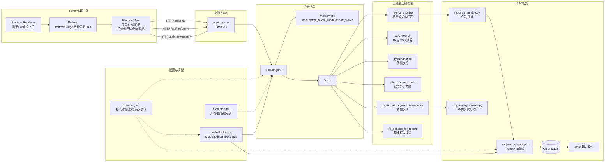

## 项目架构示意（Mermaid）

### 模块说明（简明中文）
- Electron Renderer/Preload/Main：桌面端 UI 与 IPC 桥接，负责把用户请求转发给本地后端并管理窗口、健康检查与自拉起。
- Flask API (`app/main.py`)：提供聊天、RAG 查询、知识库生命周期接口，对接桌面端。
- ReactAgent：统一封装 LangChain create_agent；接入中间件监控、动态提示词切换。
- 工具层：包含检索总结、联网搜索、代码执行、业务外部数据、长期记忆读写、报告模式上下文开关等。
- RAG/记忆：`rag_service` 负责检索+生成链；`vector_store` 管理 Chroma 知识库；`memory_service` 复用同库实现用户长期记忆；底层向量持久化在 `chroma_db/`，原始知识在 `data/`。
- 配置与模型：`config/*.yml` 管理模型、向量、提示词路径；`prompts/*.txt` 存储提示词；`model/factory.py` 暴露聊天/embedding 模型实例。
